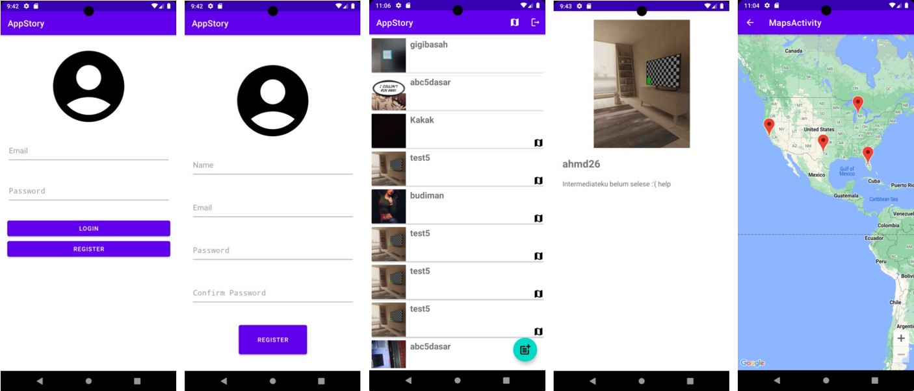

## Aplikasi AppStory

Aplikasi ini dibuat sebagai submission untuk Android Intermediate Dicoding. 
Aplikasi ini menggunakan API Dicoding untuk login/register, lihat story, dan tambah story serta juga dengan API Maps 

Fitur-fitur:
- Login dan Register akun
- Lihat daftar cerita dengan gambar
- Lihat detail cerita dan gambar
- Lihat lokasi cerita
- Tambah cerita dengan gambar bisa dari kamera ataupun dari galeri
- Keluar/logout akun

 

 
 

### Library yang dipakai

    //GLIDE
    implementation 'com.github.bumptech.glide:glide:4.11.0'

    //RETROFIT dan OKHTTP
    implementation 'com.squareup.retrofit2:retrofit:2.9.0'
    implementation 'com.squareup.retrofit2:converter-gson:2.9.0'
    implementation 'com.squareup.okhttp3:logging-interceptor:4.9.0'

    //CAMERAX
    def camerax_version = "1.2.2"
    implementation "androidx.camera:camera-camera2:${camerax_version}"
    implementation "androidx.camera:camera-lifecycle:${camerax_version}"
    implementation "androidx.camera:camera-view:${camerax_version}"

    //MAPS
    implementation 'com.google.android.gms:play-services-maps:18.1.0'